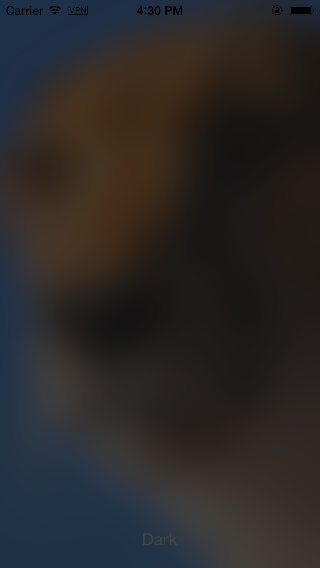

Collect some helpers for ios development.

#Install
	
	pod "ios-helpers"

#Import
	
	#import "UIViewHelper.h"
	//etc

#Helpers

##UIBezierPath+Image
1. You can create image from a bezier path
		
		- (UIImage *)imageWithStrokeColor: (UIColor *)stroke_color andFillColor: (UIColor *)fill_color;

##NSString+Extension
1. md5 string
		
		- (NSString *)MD5String

2. string from number
	
		+ (NSString *)fromFloat: (float)value
		+ (NSString *)fromInteger: (int)value	
3. emtpy?
	
		- (BOOL)empty

##UIScrollView+DeliveryAllEvents
Delivery all events

		- (void)touchesEnded:(NSSet *)touches withEvent:(UIEvent *)event
		{
		    [self.nextResponder touchesEnded:touches withEvent:event];
		}

##UIScrollView+DeliveryEvent
UIScrollView prevents all events by defaul, except panning. You can add other events to scroll view now, except panning. 

I know that apple does not advocate override method in category, but it works.

		- (void)touchesEnded:(NSSet *)touches withEvent:(UIEvent *)event
		{
		    if (!self.dragging)
        		[self.nextResponder touchesEnded: touches withEvent:event];
		    else
		    	[super touchesEnded: touches withEvent: event];
		 }

##UIView+Extension
1. remove all subviews
		
		- (void)removeAllSubviews;
2. set width, height, x and y
		
		- (void)setWidth: (CGFloat)width;
		- (void)setHeight: (CGFloat)heigth;
		- (void)setOriginY: (CGFloat)y;
		- (void)setOriginX: (CGFloat)x;
		
##UIImage+ImageEffects

it comes from apple, you can add effects to image like ios7.
		
		- (UIImage *)applyLightEffect;
		- (UIImage *)applyExtraLightEffect;
		- (UIImage *)applyDarkEffect;
		- (UIImage *)applyTintEffectWithColor:(UIColor *)tintColor;

		- (UIImage *)applyBlurWithRadius:(CGFloat)blurRadius tintColor:(UIColor *)tintColor saturationDeltaFactor:(CGFloat)saturationDeltaFactor maskImage:(UIImage *)maskImage;

##UIImage+Additions
1. burn tint color to image

		
		- (UIImage *)imageWithTintColor: (UIColor *)color;
		
##CookiesHelper
1. persist cookies after app exit

		+ (void)storeCookiesWithURL: (NSString *)url_string;
		
		+ (NSArray *)cookiesWithURL: (NSString *)url_string;
		
		+ (void)loadCookiesWithURL: (NSString *)url_string;
		
		+ (void)removeCookiesWithURL: (NSString *)url_string;

##UIViewHelper
1. zoom in and zoom out a view
	
		
		+ (void)ZoominView: (UIView *)aView withFinishBlock: (void (^)())block;
		
		+ (void)ZoomoutView: (UIView *)aView withFinishBlock: (void (^)())block;
	
##NSTimer+Blocks
1. Add blocks for timer

		
		+(id)scheduledTimerWithTimeInterval:(NSTimeInterval)inTimeInterval block:(void (^)())inBlock repeats:(BOOL)inRepeats;
	
		+(id)timerWithTimeInterval:(NSTimeInterval)inTimeInterval block:(void (^)())inBlock repeats:(BOOL)inRepeats;
	
	
##UIAlertView+Extension
1. Disable or enable a button in UIAlertView. (not working on ios7)
	
	
	
		- (void)disableButtonWithTitle: (NSString *)title;
		
		- (void)enableButtonWithTitle: (NSString *)title;
		
		
		

#License

The MIT License (MIT)

Copyright (c) 2014 Yijun Huang (https://github.com/eleven-huang).

Permission is hereby granted, free of charge, to any person obtaining a copy
of this software and associated documentation files (the "Software"), to deal
in the Software without restriction, including without limitation the rights
to use, copy, modify, merge, publish, distribute, sublicense, and/or sell
copies of the Software, and to permit persons to whom the Software is
furnished to do so, subject to the following conditions:

The above copyright notice and this permission notice shall be included in
all copies or substantial portions of the Software.

THE SOFTWARE IS PROVIDED "AS IS", WITHOUT WARRANTY OF ANY KIND, EXPRESS OR
IMPLIED, INCLUDING BUT NOT LIMITED TO THE WARRANTIES OF MERCHANTABILITY,
FITNESS FOR A PARTICULAR PURPOSE AND NONINFRINGEMENT. IN NO EVENT SHALL THE
AUTHORS OR COPYRIGHT HOLDERS BE LIABLE FOR ANY CLAIM, DAMAGES OR OTHER
LIABILITY, WHETHER IN AN ACTION OF CONTRACT, TORT OR OTHERWISE, ARISING FROM,
OUT OF OR IN CONNECTION WITH THE SOFTWARE OR THE USE OR OTHER DEALINGS IN
THE SOFTWARE.
	
	
	